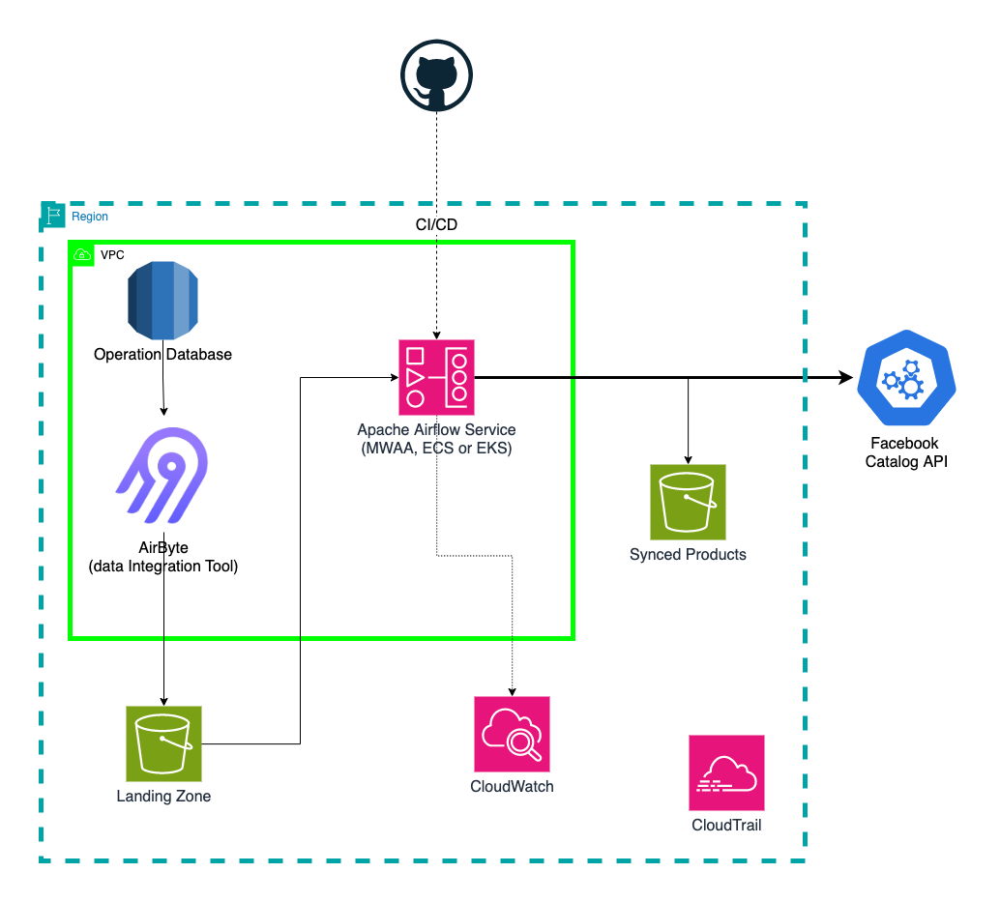
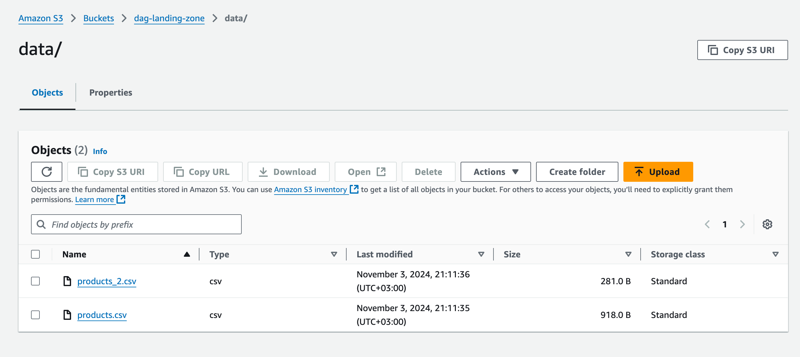
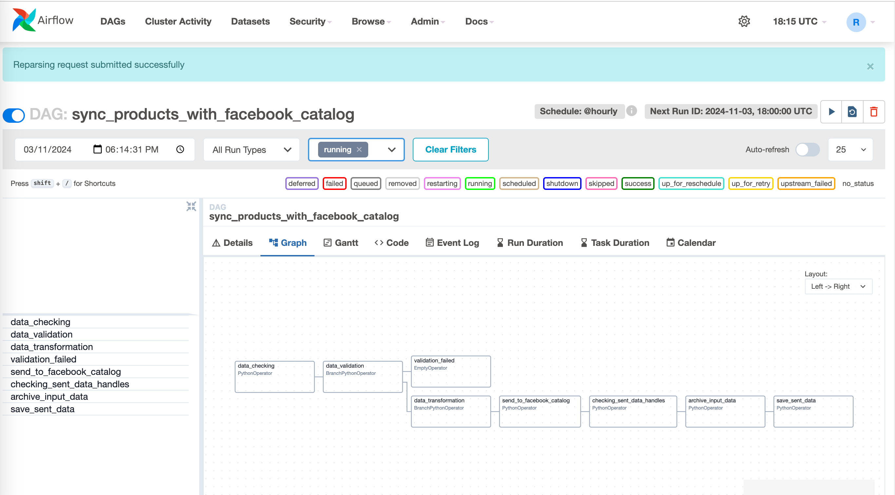
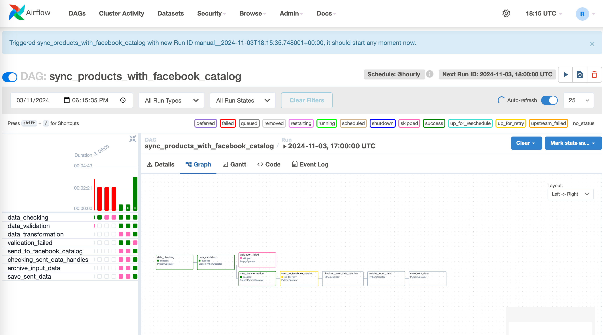
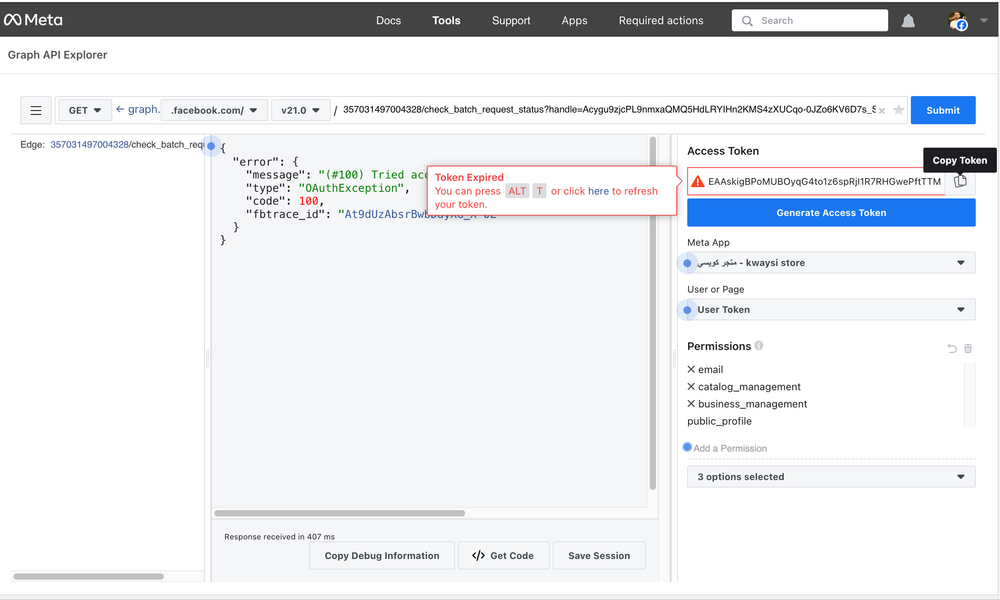
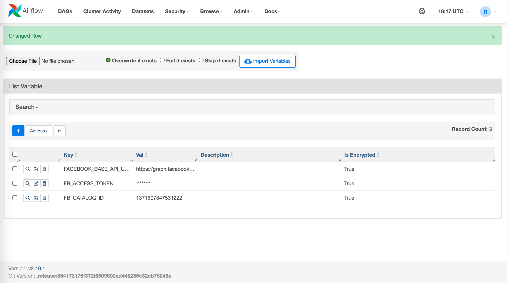
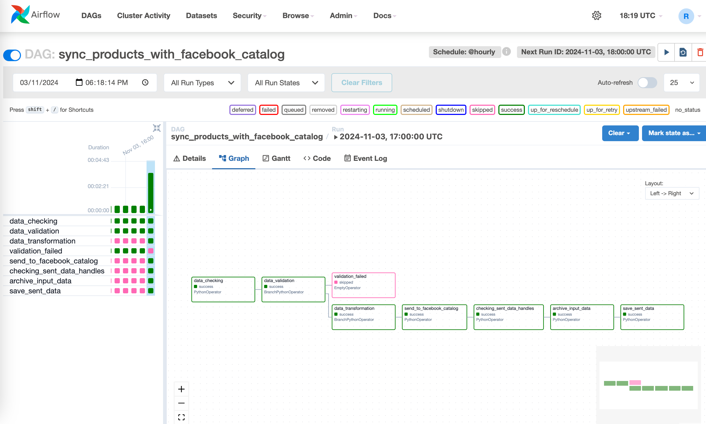
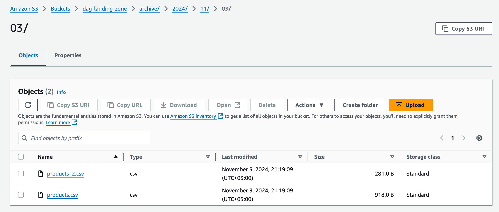
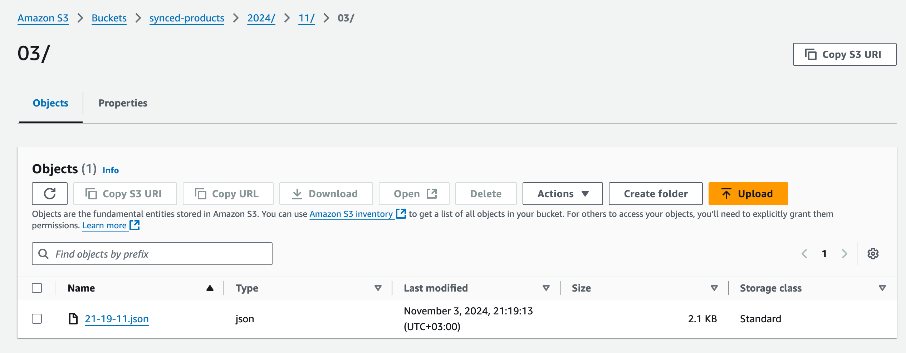
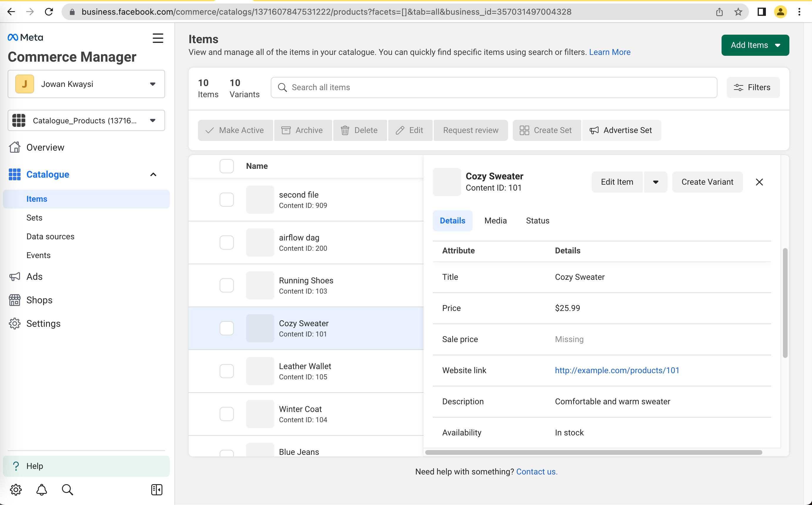

# Launching the DAG

## Don't forget to read the documentation inside "docs" folder

## Prerequisites

1. **Install Apache Airflow**:
   
   Use the MWAA Managed Workflow for Apache Airflow, it could be run on local machine  or on AWS cloud.
   or instlling it on ECS or EKS AWS Services.


## Setting Up the DAG

1. **Define Variables**:
   Before running the DAG, you need to define the necessary variables in Airflow. You can do this through the Airflow UI or by using the CLI.

   To define variables via the UI:
   - Access the Airflow web server (usually at `http://localhost:8080`).
   - Navigate to Admin -> Variables.
   - Add the required variables such as S3 bucket names and other configurations.

   To define variables via the CLI:
   ```bash
   airflow variables set <KEY> <VALUE>
   ```

2. **Place `miswag.py` in the DAGs Folder**:
   Copy the `miswag.py` file into the Airflow DAGs folder. The default location is usually `~/airflow/dags/`.

3. **Modify Variables in the Code**:
   Open the `miswag.py` file and change the necessary variables, including S3 bucket names and any other configurations specific to your environment.

   ```python
   # Example of modifying variables in miswag.py
   S3_BUCKET_NAME = "your-s3-bucket-name"
   ANOTHER_VARIABLE = "another-value"
   ```

4. **Trigger the DAG**:
   - Access the Airflow web server at `http://localhost:8080`.
   - Find your DAG in the list and click on the "Trigger DAG" button to start the workflow.

## Diagrams

### Infrastructure Diagram


### Data Flow Diagram


## Screenshots of DAG Implementation
### Landing Zone (S3 Bucket)


### Run the DAG manually


### DAG failed due to Facebook token expired and will retry in 3 mins


### Renew the acess token (getting the new access token form Facebook)


### Update the new token in Admin>>Varaibles>>FB_ACCESS_TOKEN


### DAG retry and completed successfuly


### Input data moved to archive


### Sent products saved in (Sync-Products) s3 bucket in JSON format


### Products are now avilable in Facebook Commerce Manager
