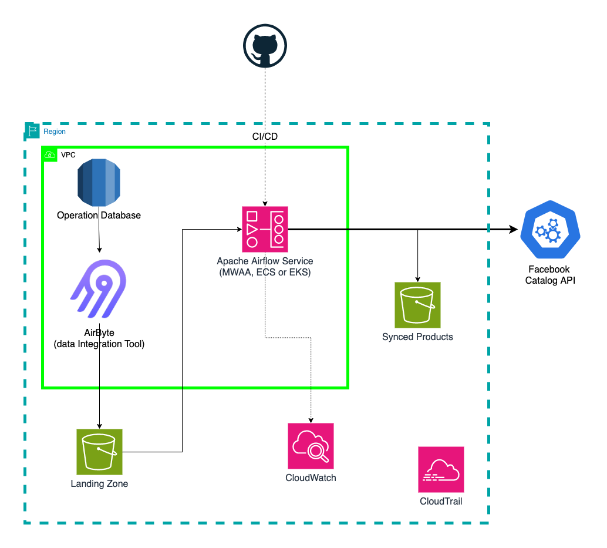

# Architecture Overview



### Architecture Overview Summary:

This architecture establishes a comprehensive framework for synchronizing product data between our operational database and the Facebook Catalog API. Data is ingested using Airbyte into an S3 bucket, organized for easy access and error tracking. Apache Airflow orchestrates data workflows, while GitHub manages version control and CI/CD processes for DAG deployments. The Facebook Catalog API's `items_batch` endpoint facilitates efficient bulk uploads and updates of product information. Monitoring and logging are handled through AWS CloudWatch and CloudTrail, ensuring operational visibility and compliance. Overall, this solution integrates best practices for effective data management and catalog synchronization.

### Business Value:

Ensuring the Facebook Catalog remains synchronized with the operational database is critical. When new products are added or existing product information is updated in the operational database, these changes should be promptly reflected in the Facebook Catalog. The volume of data updates varies significantly, ranging from no changes to hundreds of updates within an hour.

From a business impact perspective, a sync delay of up to one hour typically has minimal or no effect on sales. Technically, sending the entire database to the Facebook Catalog every hour would incur excessive costs and add unnecessary complexity to the data pipeline. Instead, we will optimize this process by identifying only the products that have been added or updated in the last hour and sending those to the Facebook Catalog, significantly improving efficiency and reducing costs.

### Data Source:

The primary source of product data is the operational database, likely a relational database such as MySQL or PostgreSQL. Miswag has approximately 5,000 products, and to efficiently handle data ingestion, we’ll use Airbyte to load newly added or updated products hourly into an S3 bucket. A lightweight transformation will format the data to align with the following schema:

```markdown
id,title,description,link,image_link,availability,price,brand,condition,product_type
101,Cozy Sweater,Comfortable and warm sweater,http://example.com/products/101,http://example.com/images/101.jpg,in stock,25.99 USD,BrandA,new,Apparel > Clothing > Sweaters
102,Blue Jeans,Stylish slim-fit jeans,http://example.com/products/102,http://example.com/images/102.jpg,in stock,45.50 USD,BrandB,new,Apparel > Clothing > Jeans
103,Running Shoes,Lightweight running shoes,http://example.com/products/103,http://example.com/images/103.jpg,preorder,75.00 USD,BrandC,new,Sports > Footwear > Running Shoes
104,Winter Coat,Thermal-insulated coat,http://example.com/products/104,http://example.com/images/104.jpg,in stock,120.00 USD,BrandD,new,Apparel > Clothing > Coats
105,Leather Wallet,Genuine leather wallet,http://example.com/products/105,http://example.com/images/105.jpg,out of stock,30.00 USD,BrandE,new,Accessories > Wallets
```

This ingestion step is outside the current project scope and depends on the company’s established infrastructure strategy for data engineering projects. Alternatively, a scheduled Apache Airflow DAG could be implemented to handle the periodic ingestion from the operational database to the S3 bucket.

### Landing Zone (S3 bucket):

The S3 bucket serves as the landing zone to store data loaded hourly from the operational database. This bucket is organized into two folders: one for the raw data directly ingested from the database, and another for archiving. When the Apache Airflow DAG successfully pushes data to the Facebook Catalog, the used data is moved from the landing folder to the archive folder, where it is retained for one month before automatic deletion using S3’s object lifecycle configuration. This archive provides a reliable reference point for data verification in case of any errors.

**Justification for selecting S3:**

S3 was chosen as the landing zone due to its compatibility with our AWS environment, offering a straightforward and cost-effective integration. It is fully managed, supports private and public access, and scales automatically to handle data volume fluctuations. S3’s high durability and availability (99.999999999%) ensure data integrity, while lifecycle management automates data retention to control costs. With enhanced security through IAM and encryption, and seamless integration with other AWS services, S3 provides an optimal, efficient, and secure solution for our data storage needs.

### Apache Airflow Service:

Apache Airflow is a widely adopted, open-source tool for orchestrating complex data workflows, valued for its strong community support and robust feature set. As a Python-based workflow orchestration platform, Airflow provides highly flexible Directed Acyclic Graphs (DAGs) that can accommodate complex workflows and dependencies.

For deployment on AWS, there are several options based on cost, scalability, and maintenance considerations. Managed Workflows for Apache Airflow (MWAA) provides a fully managed and scalable solution, ideal for teams needing minimal setup, though it is relatively costly (around $0.50 per hour). Alternatively, deploying Airflow on AWS services like ECS (Elastic Container Service) or EKS (Elastic Kubernetes Service) offers scalability and cost-efficiency with higher performance. However, these options require substantial initial setup and ongoing maintenance, making MWAA potentially more suitable if the priority is operational simplicity over setup effort.

**Justification for selecting Apache Airflow:**

While alternative tools such as Mage AI, Dagster, and Prefect offer advanced features and, in some cases, improved performance, Airflow remains the preferred choice here. Its maturity as one of the earliest orchestration tools has established a broad community, extensive documentation, and usage in large-scale projects, which simplifies collaboration and knowledge sharing, especially within teams of varying expertise.

### GitHub:

GitHub is ideal for CI/CD in Airflow deployments due to its automated testing and deployment capabilities with GitHub Actions, which streamline validation and deployment of DAG files, reducing production errors. Its version control allows for efficient tracking of changes, promoting collaboration and documentation within teams. With seamless integration to AWS, GitHub enables direct deployments to environments like MWAA, ECS, or EKS. Additionally, GitHub’s security features, such as branch protections and access controls, ensure a secure, controlled deployment pipeline aligned with best practices.

### CloudWatch:

CloudWatch is selected for this project as it enables **real-time monitoring** of Airflow workflows, including resource usage, job status, and failure alerts, allowing quick responses to operational issues. Its **centralized log management** consolidates logs across Airflow instances, making it easier to trace events and analyze workflows. Additionally, **custom metrics** can be created to track specific parameters of interest, enhancing visibility into the Airflow environment.

### CloudTrail:

CloudTrail complements this by providing a **detailed audit trail** of all user and service interactions within AWS, recording API calls, and tracking changes in the environment. This supports **security and compliance** by offering insights into who accessed what and when, crucial for maintaining control over the data pipeline and detecting unauthorized activity. The integration of CloudTrail with CloudWatch alerts further improves **incident response** by notifying the team of any suspicious activities.

### Synced Products (S3 Bucket):

The Synced Products S3 bucket is essential for tracking the transformed data sent to the Facebook Catalog API. It serves as a reliable repository to reference in the event of any issues encountered during data loading to the Facebook Catalog, facilitating troubleshooting and resolution. the data in this bucket will be deleted automatically after 1 month.

### Facebook Catalog API:

The Facebook Catalog API will be leveraged to effectively synchronize product data, specifically utilizing the [`items_batch`](https://developers.facebook.com/docs/marketing-api/catalog-batch/guides/send-product-updates) endpoint for bulk uploads of product information. This approach facilitates the efficient handling of multiple products simultaneously, streamlining the data synchronization process. The [`items_batch`](https://developers.facebook.com/docs/marketing-api/catalog-batch/guides/send-product-updates) endpoint supports the creation, updating, and deletion of products; however, we will not be utilizing the deletion functionality. Instead, we will focus on the "UPDATE" feature, which allows for an UPSERT operation, enabling us to add new products or update existing ones seamlessly. Notably, this endpoint can process a maximum of 5,000 products in a single request, further enhancing our ability to manage large volumes of product data efficiently.

After submitting the batch request, we will use the [`check_batch_request_status`](https://developers.facebook.com/docs/marketing-api/catalog-batch/guides/get-batch-request) endpoint to monitor the status of the uploaded items, ensuring that all products are processed correctly and identifying any potential errors that may arise during the synchronization process. This approach enhances the reliability of our integration with the Facebook Catalog, allowing for prompt resolution of issues and maintaining up-to-date product listings.