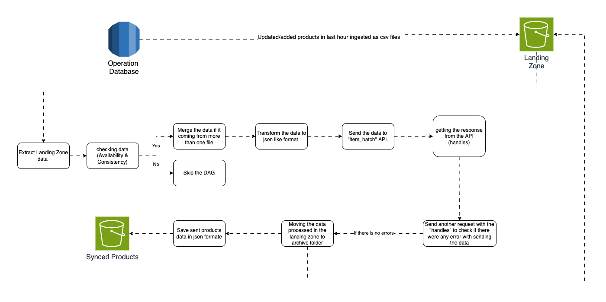
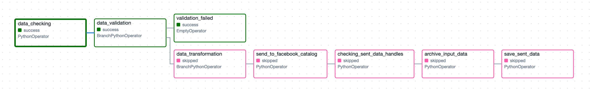
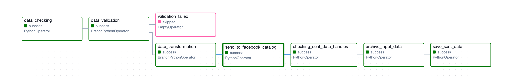

# Data Flow



Dag diagrams





# Data Flow

This document outlines the data flow for synchronizing product data from a source database to the Facebook Catalog via a scheduled Apache Airflow DAG. The DAG currently operates on an hourly schedule but can be enhanced to trigger automatically upon new data arrival in the landing zone. Below is a breakdown of each process step, including improvement suggestions where applicable.

### Extracting Data from Database to Landing Zone

*Note: This step is outside the scope of this project.*

Data should be extracted at intervals of 1 to 3 hours, capturing only newly added or updated products. This can be achieved by monitoring the  `updated_at` 

timestamp column in the database. The extracted data should be stored as CSV files in an S3 bucket within the landing zone.

### Data Checking

The task checks the `S3://landing-zone/data` directory for CSV files. Each file’s contents must align with the following columns:

```markdown
{"id", 
"title", 
"description", 
"link", 
"image_link", 
"availability", 
"price", "brand", 
"condition", 
"product_type"}
```

If the data is in the correct format, the DAG proceeds to the next step.

### Data Validation

This step validates the data structure and completeness. If data is missing or columns are incorrect, the DAG moves to the `validation_failed` task, which skips the remaining steps. If the data passes validation, the DAG proceeds to the `data_transformation` task.

### Data Transformation

In this step, validated product data from multiple files (if any) is merged and reshaped into JSON format required by the Facebook Catalog API. The data structure will look like:

```json
{
    "method": "UPDATE",
    "data": {
        "id": "id",
        "title": "title",
        "description": "description",
        "availability": "availability",
        "price": "price",
        "link": "link",
        "image_link": "image_link",
        "brand": "brand",
        "condition": "condition",
        "google_product_category": "product_type"
    }
}

```

## Send to Facebook Catalog API

The transformed data is sent to the Facebook Catalog API endpoint (`items_batch?item_type=PRODUCT_ITEM`). The API response includes "handles," which are used in the next step to check for errors.

***Improvement Needed*:** The Facebook Catalog API accepts a maximum of 5,000 products per request. If the number of products exceeds this limit, the data should be split into batches.

### Checking sent data handles

Using the provided "handles," a GET request is sent to `check_batch_request_status`. This returns any errors or warnings associated with the data processing.

***Improvement Needed*:** Implement alert notifications (via email, CloudWatch, or Amazon SNS) to notify the team of errors or warnings that may require immediate action.

### Archiving Input Data

Once the data has been sent to the Facebook Catalog, it is moved from the `data` folder in the landing zone to the `archive`folder. Data is retained in the archive for 30 days, after which it is automatically deleted by an S3 lifecycle policy. This archiving reduces storage costs and provides a temporary reference if data review is needed.

### Saving Sent Data

The JSON-transformed data sent to the Facebook Catalog API is stored in the `Synced Products` bucket for 30 days. This retention period allows for troubleshooting in case of sync errors. Limiting the retention period also reduces costs, as this bucket is not a primary data source.